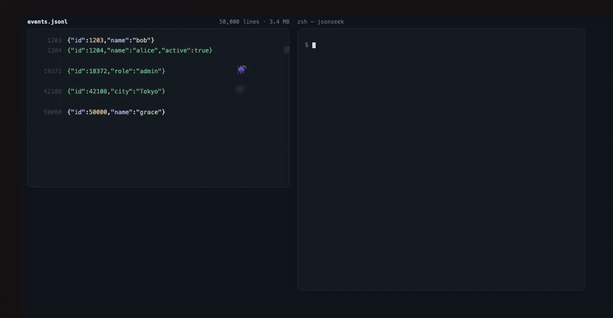

# jsonseek

[](https://badge.fury.io/py/jsonseek)
[](https://pepy.tech/project/jsonseek)
[](https://opensource.org/licenses/MIT)
[](https://www.python.org/downloads/) [](https://www.npmjs.com/package/jsonseek-dsh)

[English](./README.md) | [中文](./README_ZH.md)

**JSON/JSONL parsing toolkit, designed for LLMs.**

---

## 🤖 DeepSeek Harness plugin support

`jsonseek` ships as a native [DeepSeek Harness](https://github.com/deepseek-ai/deepseek-harness) (dsh) bundle. Once installed, every `jsonseek <sub-command>` becomes a model-callable tool inside a dsh agent — and `jsonseek` shows up in **Settings → Plugin list** alongside the dsh built-ins.

```bash
# 1. Install the Python CLI (the dsh plugin shells out to it)
pip install jsonseek

# 2. Install the dsh bundle into the profile you boot with `dsh web`
dsh plugin --profile web add jsonseek-dsh

# 3. Restart dsh — jsonseek-dsh now appears in Plugin list,
#    and the agent has 14 jsonseek_* tools available.
dsh restart    # or your usual restart command
```

That's the whole install. **No source patches to JSONSEEK, no fork** — the npm bundle is a separate data-only package that translates each `jsonseek_<cmd>({...})` call into the corresponding `jsonseek` CLI invocation.

After install the dsh agent can do things like:

> "Use jsonseek_shape to inspect `data.json` and jsonseek_query to find every record mentioning 'password'."

The model picks the right tool, your CLI handles the file.

**Documentation:**

- [`npm/QUICKSTART.md`](./npm/QUICKSTART.md) — 30-second install + verification
- [`npm/README.md`](./npm/README.md) — full usage, publishing, troubleshooting

---

## 💸 Stop paying for tokens you don't read

Loading a JSON file into an LLM context window is expensive. A 10 MB JSON is roughly **2.5M tokens** — on Claude Opus that's **~$15 per task** for one file.

`jsonseek` gives you surgical commands so you pay only for what you actually need:

```bash
jsonseek shape file.json       # skeleton, ~50 tokens
jsonseek fields file.json      # keys + types, ~200 tokens
jsonseek query file.json 'X'   # search content, ~100 tokens
jsonseek get file.json path    # fetch one value, ~50 tokens
```

**10 MB → 5 KB.** Same answer, 1000× cheaper.
> When LLMs touch JSON, they should `shape` first, `query` second, never `cat` the whole file.
> When humans touch JSON, the same rules apply — just with a keyboard instead of a context window.



> 三条记录被咬坏。`shape` 一次全部找出来，`replaceline` 只改第 18372 行，其余
> 49,997 行逐字未变。上面的输出是真跑出来的，不是排版出来的。


---

## 🐛 Tells you exactly which line is broken

When something's wrong, `jsonseek` reports the **exact line and the parser's own message** — so the LLM (or you) can fix it in one shot instead of guessing:

```
$ jsonseek shape broken.jsonl
Error: Found 2 invalid lines in broken.jsonl:
  Line 2: {"id": 2, "name": "unterminated
    Error: Unterminated string starting at
  Line 4: {"id": 4,,}
    Error: Expecting property name enclosed in double quotes
```

```
$ jsonseek shape broken.json
Error: Invalid JSON at line 4 in broken.json
  Line 4:   "c": 3
  Expecting ',' delimiter
```

**JSONL reports every bad line. JSON reports only the first.** Each JSONL record is independent; a JSON document is not — once it's broken, only the first error is recoverable.

Then fix in place:

```bash
jsonseek replaceline broken.jsonl 2 '{"id": 2, "name": "fixed"}'
jsonseek replaceline broken.jsonl 4 '{"id": 4, "name": "fixed"}'
```

---

`jsonseek` is an **LLM-friendly parser and partial editor for large JSON / JSONL files**. The core principle: **never let an LLM `cat` an entire JSON file into context**. Run `shape` for the skeleton, `query` / `get` for precise lookup, then `set` / `add` / `del` / `append` for the smallest possible edit.

Supports **structural understanding, field summaries, partial queries, partial edits, bug localization and repair** — for both JSON and JSONL with one command set.

---

## 🤖 Skills for LLM Coding Agents (Claude / Kimi / Cursor / Codex, etc.)

> **Tell your agent "use jsonseek" and it just works.** Skills live below — read on demand.

| Skill | Link | Use |
|---|---|---|
| **SKILL.md** | 👉 [View on GitHub](https://github.com/lo2589/JSONSEEK/blob/main/skills/jsonseek/SKILL.md) | Agent startup: triggers, command cheatsheet, **the three iron rules for writes**, Windows API fallback |
| **commands.md** | 👉 [View on GitHub](https://github.com/lo2589/JSONSEEK/blob/main/skills/jsonseek/references/commands.md) | On demand: every flag / example / output format |
| **path-syntax.md** | 👉 [View on GitHub](https://github.com/lo2589/JSONSEEK/blob/main/skills/jsonseek/references/path-syntax.md) | On demand: full path syntax (dot / bracket / mixed / array / escape) |

**Skills on GitHub**: [`lo2589/jsonseek/skills/jsonseek/`](https://github.com/lo2589/JSONSEEK/tree/main/skills/jsonseek)

**Plug into an agent** (Claude Code / Cursor / Codex / etc.):

```bash
git clone https://github.com/lo2589/JSONSEEK.git
ln -s ../jsonseek/skills/jsonseek/SKILL.md ~/.claude/skills/jsonseek.md
# or ~/.cursor/skills/   ~/.codex/skills/
```

---

## Why JSON Deserves a Dedicated Tool

JSON is the de facto standard for modern data exchange. From ML experiment logs, API configs, application log streams, to microservice registries and crawler dumps — JSON / JSONL is everywhere:

- **ML experiment tracking**: training parameters, metric curves, and model configs all live as JSON. A single experiment directory can easily reach tens of MB.
- **API / microservice configs**: service discovery, routing rules, environment variables — often managed as JSON configs.
- **Logs & event streams**: structured logs (JSONL) are easier to query than plain text, but file size grows fast.
- **Data exchange**: frontend-backend communication, inter-service RPC, crawler dumps — JSON is the most common format.

**The problem: the bigger the JSON, the more expensive it is to process.** `cat`-ing a 10MB JSON into LLM context burns millions of tokens. Even human developers suffer scanning thousands of nested lines.

**`jsonseek` solves this** — replace full reads with partial operations, replace manual scanning with structured queries. For **LLM coding agents and developers** handling JSON / JSONL frequently, this is essential tooling.

---

## Why LLMs Should Use jsonseek

When you (or your running Claude / Kimi / Cursor / Codex agent) face a 10MB JSON, full `cat` into context is **catastrophic token waste**. `jsonseek` lets the agent:

1. **Understand structure first** — `shape` for the skeleton, `fields` for the field list, **without reading content**
2. **Locate targets next** — `query` to search keywords, `ls` to browse a layer, `get` for a precise value
3. **Edit partially last** — `set` / `add` / `del` / `append` only where needed

### Token savings estimate

| File size | Operation | Full read | `jsonseek` output | Savings |
|---|---|---|---|---|
| 100KB config JSON | `shape` | ~25K tokens | ~100 tokens | **99%+** |
| 100KB config JSON | `fields` | ~25K tokens | ~300 tokens | **98%+** |
| 100KB config JSON | `get` single value | ~25K tokens | ~10 tokens | **99%+** |
| 100KB config JSON | `query` hit a few | ~25K tokens | ~100 tokens | **99%+** |
| 10MB log JSONL | `shape` sampled | ~2.5M tokens | ~200 tokens | **99.9%+** |
| 10MB log JSONL | `query` hit dozens | ~2.5M tokens | ~1K tokens | **99.9%+** |

> Rough estimate: 1 token ≈ 4 bytes of English. Actual ratios vary by content and tokenizer, but the order of magnitude is stable — **the bigger the file, the bigger the savings**.

### Typical agent workflow

```bash
# 1. Read the skeleton — no content needed
jsonseek shape data.jsonl

# 2. See the field list
jsonseek fields data.jsonl --top

# 3. Search a keyword
jsonseek query data.jsonl password --record-id-field id --max-results 5

# 4. Read a specific value
jsonseek get data.jsonl '[3].password'

# 5. Modify (**always start with --dry-run**)
jsonseek set data.jsonl '[3].password' 'newpass' --dry-run
jsonseek set data.jsonl '[3].password' 'newpass' --backup
```

---

## 📦 Installation

```bash
pip install jsonseek
```

Requires Python 3.8+. **Zero dependencies, zero configuration** — install and run.

```bash
$ jsonseek --version
jsonseek <current_version>
```

---

## Command reference

### Read / inspect (safe, read-only)

| Command | Purpose |
|---|---|
| `shape FILE` | Display structure / skeleton tree |
| `fields FILE [keyword]` | List all fields and types |
| `ls FILE [path]` | List children at a path |
| `get FILE path` | Get a value at a path |
| `query FILE keyword` | Search keys or values |
| `extract PATTERN path` | Batch-extract the same path from many JSON files |
| `concat PATTERN` | Merge multiple JSON files into JSONL |

### Write / partial edits (modifies files)

| Command | Purpose |
|---|---|
| `set FILE path value` | Modify a field |
| `add FILE path value` | Add a new key |
| `del FILE path` | Delete a key or array element |
| `append FILE path value` | Append one item to an array |
| `extend FILE path json_array` | Extend an array from a JSON array |
| `cutline FILE N` | Extract a specific JSONL line to a temp file |
| `replaceline FILE N` | Replace a specific JSONL line |

### Common flags

| Flag | Purpose |
|---|---|
| `--output json` | Machine-readable output (required when piping to another tool / agent) |
| `--backup` | Create a `.bak` backup before any write |
| `--dry-run` | **Always use this before any write to preview** |
| `--kind {json,jsonl}` | Force file type (auto-detected by default) |
| `--encoding ENCODING` | Force encoding (auto-detected by default; e.g. `gbk`) |
| `--context N` | Lines of context around the target (JSONL only, default `2`) |

### Path syntax

| Style | Example | Meaning |
|---|---|---|
| Dot | `a.b.c` | `a -> b -> c` |
| Bracket | `a[key1][key2]` | `a -> key1 -> key2` |
| Mixed | `a[key1].b[0]` | `a -> key1 -> b -> 0` |
| Array index | `items[0][1]` | `items -> 0 -> 1` |

> **⚠️ zsh users**: paths containing `[N]` must be wrapped in single quotes (or use `noglob`), because zsh tries to glob-expand brackets:
> ```bash
> # ❌ zsh: "no matches found"
> jsonseek del file.json services[0].deprecated
>
> # ✅ either of these works
> jsonseek del file.json 'services[0].deprecated'
> noglob jsonseek del file.json services[0].deprecated
> ```
> bash / fish / zsh-with-quotes all work fine.

---

## The three iron rules (for LLMs and humans)

1. **Before any write, always `--dry-run` first**:
   ```bash
   jsonseek set file.json path value --dry-run
   # [DRY-RUN] Before: path = old
   # [DRY-RUN] After:  path = new
   ```
2. **Before any write, always add `--backup`**:
   ```bash
   jsonseek set file.json path value --backup
   # → creates file.json.bak
   ```
3. **When piping to another tool, always add `--output json`**:
   ```bash
   jsonseek query file.json keyword --output json | jq '.hits[0]'
   ```

---

## Designed for AI / Coding Agents

`jsonseek`'s design philosophy is **the LLM's token budget**:

- **Output as short as possible**: by default only the filtered essentials, never the whole structure
- **Stable output format**: every command supports `--output json`, agents parse directly
- **Writes are previewable**: every `set` / `add` / `del` has `--dry-run`, agents preview the diff before invoking
- **Streaming**: `jsonseek shape` on a 10MB JSONL only reads the first 100 lines (`--sample-size` adjustable), token usage is bounded

Typical agent workflow:

```text
read  → shape / fields / ls / query / get
        ↓ (understand structure)
locate → query / get
        ↓ (find target)
write  → set / add / del / append   (--dry-run first → --backup for real)
        ↓ (verify)
read   → query / get
```

---

## Cross-platform

- **macOS / Linux**: native CLI works flawlessly
- **Windows PowerShell**: **read commands** (`shape` / `fields` / `get` / `query` / `ls` / `extract` / `concat`) work fine via CLI. **Write commands** strip double quotes through PowerShell, so complex values fail — **use the Python API instead**

Windows write Python API:

```python
import sys
sys.path.insert(0, '.')

from jsonseek.commands.set_cmd import set_value
from jsonseek.commands.add_cmd import add_value
from jsonseek.commands.append_cmd import append_value
from jsonseek.commands.extend_cmd import extend_value
from jsonseek.commands.del_cmd import del_value
from jsonseek.commands.replaceline_cmd import replace_line

# Set/Add/Append/Extend complex values — no shell quoting issues
set_value('file.json', 'path', {"key": "value"})
add_value('file.json', 'path', ["item1", "item2"])
append_value('file.json', 'items', {"id": 1})
extend_value('file.json', 'items', [{"id": 2}, {"id": 3}])

# Delete
del_value('file.json', 'path')

# JSONL whole-line replacement
replace_line('file.jsonl', 5, '{"id": 5, "name": "fixed"}')
```

CLI write commands print a patch preview on success and `Error: ...` on failure. Python API write helpers are silent on success and raise on failure.

---

## 🐛 Bug diagnostics: locate, then fix (NEVER `cat` a JSON file)

`jsonseek` is built for the **"find the bad record, fix it, move on"** workflow. When an LLM (or a human) sees a parse error, the wrong shape, a missing field, or a broken value — the right move is **NOT** to dump the whole file. Use the diagnostic ladder:

### The diagnostic ladder (use in this order)

| Step | Command | What it tells you | When to use it |
|------|---------|-------------------|----------------|
| 1 | `jsonseek shape file.json` | High-level skeleton — array? object? nested? | You have no idea what's in the file |
| 2 | `jsonseek fields file.json` | Every key, every type, occurrence count | You suspect a field is wrong or missing |
| 3 | `jsonseek fields file.json 'keyword'` | Fields whose **path** matches the keyword | You know roughly where to look |
| 4 | `jsonseek query file.json 'pattern'` | Records/values whose **content** matches | You're hunting a specific value |
| 5 | `jsonseek get file.json 'path'` | The exact value at a path | You know the path, want the value |
| 6 | `jsonseek ls file.json 'path'` | Children of a path (object keys / array indices) | You have a path, want to drill in |

### Workflow A — "JSON won't parse, where's the broken record?"

For **JSONL** files (one record per line), the fastest way is usually:

```bash
# Find the offending line with a Python one-liner
python3 -c "
import json
for i, line in enumerate(open('broken.jsonl'), 1):
    try: json.loads(line)
    except Exception as e: print(f'line {i}: {e} — {line[:80]!r}')
"

# Then fix it
jsonseek replace_line broken.jsonl <line_number> '{"id": ..., "fixed": true}'
```

For **JSON** files (single document), `shape` will fail with a parser error pointing at the byte offset:

```bash
$ jsonseek shape broken.json
Error: <tool name>: Expecting value at line 42 column 7 (char 1823)
# That `char 1823` is your offset — open the file at byte 1823 to inspect.
```

### Workflow B — "wrong field, wrong type, where?"

```bash
# Step 1: see the skeleton
jsonseek shape data.json

# Step 2: list all fields + types + occurrence counts
jsonseek fields data.json
#   id        : int    (100%)
#   name      : str    (100%)
#   email     : str    (87%)     <-- only 87%! 13% missing
#   tags      : array  (60%)
#   score     : float  (40%)     <-- type inconsistent? check
```

```bash
# Step 3: drill into the suspicious field
jsonseek query data.json 'email == null'
jsonseek get data.json '$.records[5].email'
```

```bash
# Step 4: fix the smallest possible patch
jsonseek set data.json '$.records[5].email' '"fixed@example.com"' --backup
```

### Workflow C — "I see the bug, just fix one line"

For JSONL with one record per line:

```bash
# Re-read the bad line first (avoid guessing)
jsonseek get broken.jsonl <line_number>

# Replace it
jsonseek replace_line broken.jsonl <line_number> '{"id": 42, "name": "corrected"}'
```

### Why this matters

- **Never `cat` the whole file.** A 10 MB JSON is 2.5M tokens — your context window is gone.
- **Always `shape` first.** You can't fix what you can't see.
- **Always `query` or `get` before `set`.** Confirm the location, then patch.
- **Use `--backup` on every write.** Default is to write a `.bak` next to the file.

### The diagnostic rule (memorize this)

> **Shape → Fields → Query → Get → Fix.**
> Skip a step only if you already know the answer.

---

## Complete command reference

Every command's full signature, every flag, and every output format. For the most up-to-date list, run `jsonseek <command> --help`.

### Read-only commands

#### `shape FILE`

Show structure / skeleton tree.

```
--kind {json,jsonl}        Force file kind (auto-detected by default)
--output {pretty,json}     Output format (default: pretty)
--encoding ENCODING        Force encoding (auto-detected by default)
--max-depth N              Limit traversal depth (default: unlimited)
--array-mode {sample,full} JSONL array mode; `sample` is default, `full` walks every element
--sample-size N            JSONL: number of records to sample (default: 100)
```

#### `fields FILE [keyword]`

List all fields with type / occurrence count.

```
--top                      Show only top-level fields
--kind / --output / --encoding    (same as above)
```

#### `ls FILE [path]`

List children at a path. JSONL: path must start with `[N]` or `records[N]`.

```
--kind / --output / --encoding    (same as above)
```

#### `get FILE path`

Read a value at a path. Output respects `--output`.

```
--kind / --output / --encoding    (same as above)
```

#### `query FILE term`

Search keys or values.

```
--case-sensitive           Case-sensitive matching (default: insensitive)
--exact                    Exact match (default: substring)
--match-mode {key,value,both}    What to match (default: both)
--max-results N            Limit number of results
--record-id-field FIELD    JSONL: use FIELD as record ID in output
--preview-field FIELD      JSONL: also show FIELD as preview
--kind / --output / --encoding / --context N    (same as above)
```

#### `extract PATTERN path`

Batch-extract the same path from many JSON files matched by a glob pattern.

```
--include-missing          Include files where the path does not exist (default: skip)
--output {pretty,json}     Output format (default: pretty)
```

#### `concat PATTERN`

Concatenate multiple JSON files into a single JSONL.

```
-o, --output-file FILE     Output file (default: stdout)
--no-sort                  Preserve glob order (default: sort by filename)
```

### Write commands (always `--backup` first)

#### `set FILE path value`

Modify an existing value at a path.

```
--create-missing           Auto-create intermediate paths (default: error if missing)
--from-file FILE           Read the new value from a file (avoids shell quoting issues)
--backup                   Create FILE.bak before writing
--dry-run                  Preview only, no changes
```

#### `add FILE path value`

Add a new key to an object. **Errors if the key already exists.**

```
--create-missing           Auto-create intermediate paths
--from-file FILE           Read the value from a file
--backup / --dry-run       Same as above
```

#### `del FILE path`

Delete a key or an array element.

```
-y, --yes                  Skip the confirmation prompt
--backup / --dry-run       Same as above
```

#### `append FILE path value`

**JSON**: append one item to an array. Path must end at an array.
**JSONL**: append a record at root level (no path needed).

```
--from-file FILE           Read the value from a file
--backup / --dry-run       Same as above
```

#### `extend FILE path json_array`

Extend an array with all items from a JSON array (unpacked).

```
--from-file FILE           Read the array from a file
--backup / --dry-run       Same as above
```

#### `cutline FILE LINE`

Extract a specific JSONL line (1-indexed) to a temp file. Used to repair corrupt lines.

```
--save-temp                Save to a temp file and print the path; otherwise print to stdout
```

#### `replaceline FILE LINE [CONTENT]`

Replace a specific JSONL line. Use `--from-file` to avoid quoting issues.

```
--from-file FILE           Read the replacement content from a file
```

### Universal flags (every command)

```
--kind {json,jsonl}        Force file kind (auto-detected by default)
--output {pretty,json}     pretty (default) is human-readable; json is for agent / pipe consumption
--encoding ENCODING        Force encoding (auto-detected; e.g. `gbk`, `utf-8`)
--backup                   Create FILE.bak before any write
--dry-run                  Preview the change without writing
--context N                JSONL: lines of context around the target (default: 2)
```

> **Always use `--dry-run` first.** Then add `--backup` for the real run.

### Exit codes

| Code | Meaning |
|---|---|
| 0 | Success |
| 1 | Generic error (invalid path, missing file, write error, etc.) |
| 2 | Invalid CLI arguments |

### Environment variables

| Var | Effect |
|---|---|
| `PYTHONIOENCODING` | Force stdout encoding (helps with Chinese output on Windows) |

---

## Command reference docs

| Doc | Content |
|---|---|
| [commands.md](https://github.com/lo2589/JSONSEEK/blob/main/skills/jsonseek/references/commands.md) | Every command's flags, parameters, examples |
| [path-syntax.md](https://github.com/lo2589/JSONSEEK/blob/main/skills/jsonseek/references/path-syntax.md) | Full path syntax — dot / bracket / mixed / array indices / negative indices / escapes |

> Skills links are also given earlier in the "🤖 Skills for LLM Coding Agents" section.

---

## 🔗 Links

| Resource | Link |
|---|---|
| **PyPI** | https://pypi.org/project/jsonseek/ |
| **GitHub** | https://github.com/lo2589/JSONSEEK |
| **Issues** | https://github.com/lo2589/JSONSEEK/issues |

---

## Other languages

- **English** — [README_EN.md](README_EN.md)
- **中文** — [README.md](README.md) (default, also serves as the Chinese edition)
- **中文 (简洁版)** — [README_ZH.md](README_ZH.md)

---

## License

MIT — see [LICENSE](LICENSE).
